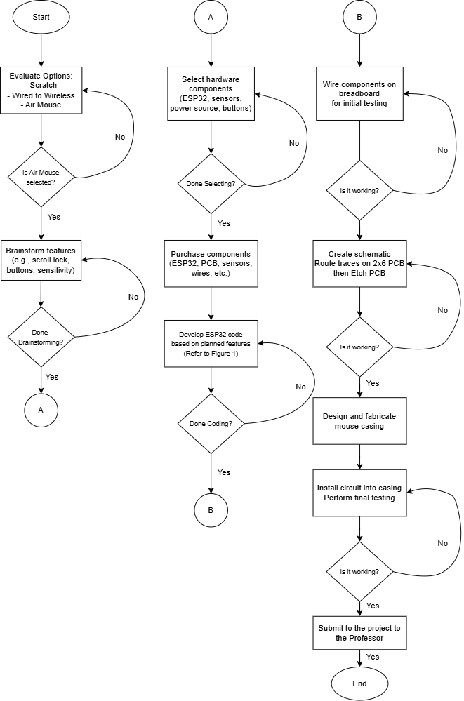
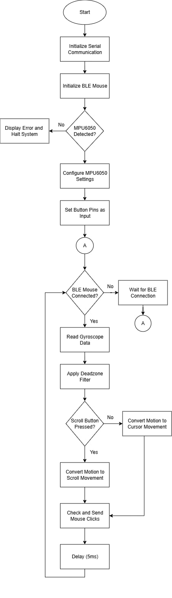
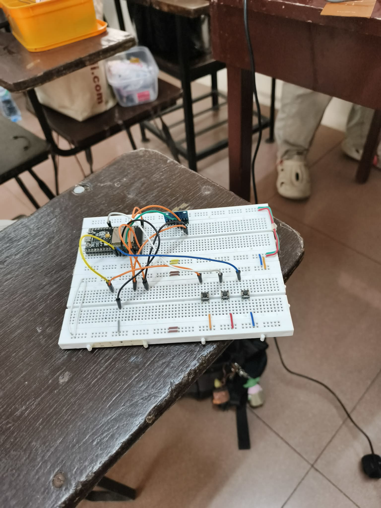
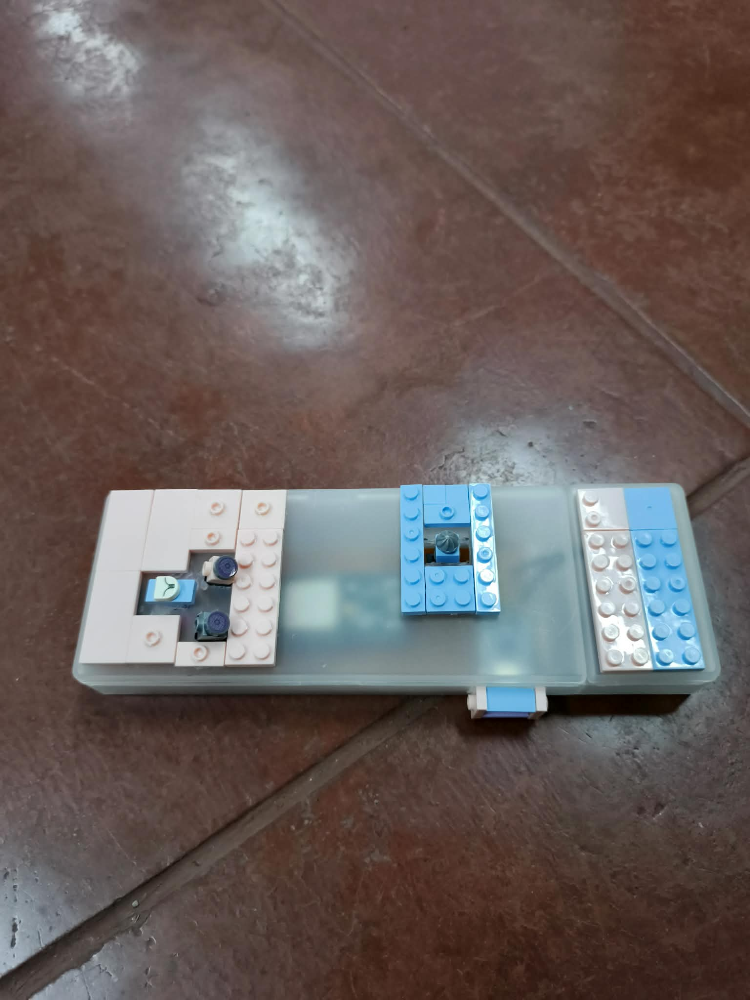
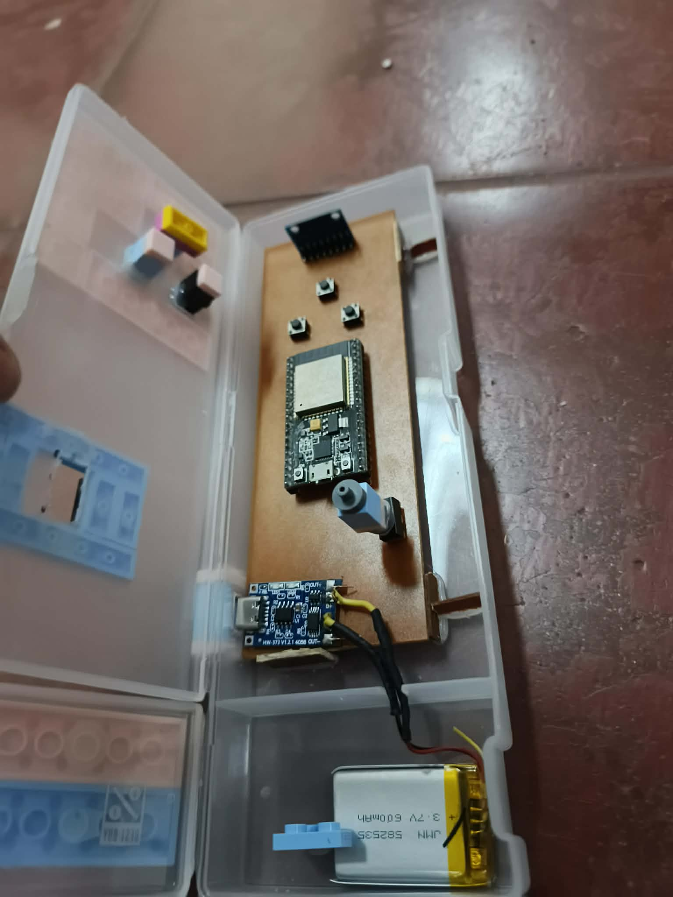

# 🖱️ GyroMouse  
**A Bluetooth Low Energy (BLE) Air Mouse built with ESP32 and MPU6050**

GyroMouse is a custom-built **air mouse** that allows users to control a computer cursor and scrolling actions using **hand movements in mid-air**. Instead of relying on an optical sensor and a flat surface, this project uses an **inertial measurement unit (IMU)** and Bluetooth Low Energy to explore surface-free human–computer interaction.

This repository documents **how the project was designed, built, tested, and refined**, from the initial idea to a fully working prototype.

## 📖 Project Background

The idea behind GyroMouse started with a simple problem: traditional mice require a physical surface, which limits their use during presentations, smart TV navigation, and mobile setups. We wanted to create an input device that could work **anywhere**, relying only on hand motion.

After evaluating different approaches—wired, wireless, and gesture-based—we decided to design an **air mouse** that uses gyroscopic motion and Bluetooth connectivity while remaining compact and portable.

## 🧠 System Overview

GyroMouse consists of four main subsystems:

- **ESP32 microcontroller** – operates as a Bluetooth Low Energy Human Interface Device (HID)
- **MPU6050 IMU** – provides gyroscope and accelerometer data
- **Physical buttons** – left click, right click, and scroll-lock
- **Battery-powered system** – enables fully wireless operation

The ESP32 continuously reads motion data from the MPU6050 and translates it into mouse actions sent wirelessly to a computer.

## 🔄 Project Roadmap

Before any hardware was built, the entire workflow of the project was planned.

### Overall Development Flow

The project followed these stages:
1. Idea evaluation and feature brainstorming  
2. Hardware component selection  
3. Initial breadboard testing  
4. Firmware development  
5. PCB layout and fabrication  
6. Final assembly and testing  

## ⚙️ Software and Progress Logic Flow

To define how the system behaves during operation, a detailed software and its implementation to the hardware (progress) flowchart was created.

### Software Flowchart

The logic follows this sequence:
- Initialize serial communication  
- Initialize BLE mouse service  
- Check MPU6050 connection  
- Configure sensor settings and button pins  
- Wait for BLE connection  
- Continuously:
  - read gyroscope data  
  - apply deadzone filtering  
  - move cursor or scroll  
  - handle button presses  

## 🧪 Breadboard Testing
All components were first tested on a breadboard before transitioning to a permanent PCB to minimize errors.
Initial testing was performed using a breadboard to verify:
- Bluetooth connectivity  
- Gyroscope responsiveness  
- Cursor movement accuracy  
- Button functionality  

This step helped identify and resolve issues early in the development process.

## 🧱 PCB Fabrication Process

PCB fabrication involved several manual steps:
1. Drawing the PCB layout  
2. Etching using ferric chloride  
3. Cleaning the board  
4. Drilling component holes  
5. Soldering components  

Manual PCB layout drawing was chosen after automated transfer methods produced inconsistent and unclear traces.

## ⚠️ Challenges Encountered

| Challenge | Solution |
|---------|----------|
| ESP32 not detected | Installed the correct ESP32 board package |
| MPU6050 issues | Used a compatible and stable sensor library |
| PCB transfer failed | Switched to manual PCB etching |
| Upload errors | Used ESP32 boot mode during flashing |
| Drilling precision | Used PCB-specific drill bits |

## ✅ Final Output

The completed **GyroMouse** functions as a fully wireless **Bluetooth Low Energy air mouse**, capable of smooth cursor control and scrolling **without requiring a physical surface**.  
The device demonstrates stable BLE connectivity, responsive motion tracking, and reliable button input.

 
